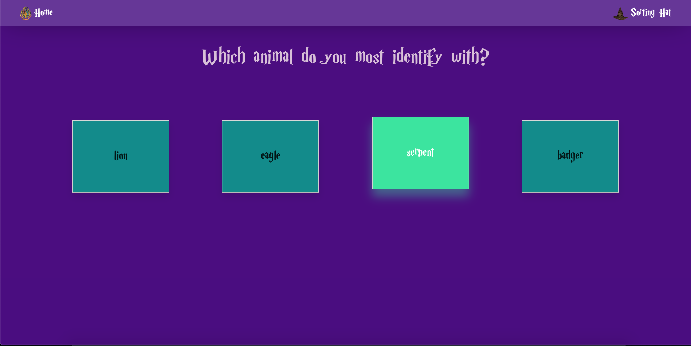
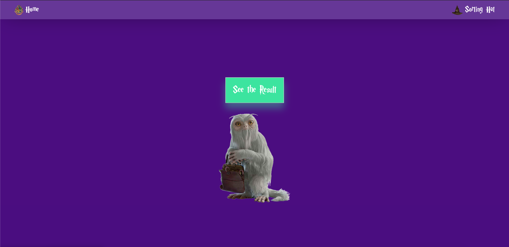

# Project 2: Sorting Hat Quiz (Harry Potter)

## Overview

A quiz emulating the sorting hat from Harry Potter. 
The time frame for this pair coding project was 48 hours.
The main game logic was completed in this time. I used the following weekend to complete the result feature (alternating result house crest images and info depending on result), and styling.

## Deployment

The website is deployed on netlify and can be found [here](https://harry-potter-sorting-hat.netlify.app/)

## Built With

* React 
* Sass
* Axios
* Express
* Node.js
* Bulma
* Git
* GitHub
* Insomnia
* potterapi

## Getting Started

Clone or download the repo. Run 'npm i' from the root directory to download all of the necessary packages and then type 'npm run start'. 

## Brief

Consume a public API - this could be anything but it must make sense for your project.
Have several components - At least one classical and one functional.
The app can have a router - with several "pages", this is up to your digression and if it makes sense for your project.
Include wireframes - that you designed before building the app.
Be deployed online and accesbile to the public.

## Website Architecture

This website is made up of a home page, a quiz page and a result page. There is also quick acess to the quiz via the navbar.

### Home Page
The home page contains a welcome message, navbar with quick acess to the quiz and a start quiz button which links to the quiz page.

```javascript
  <Link to='/quiz' className='Button'><button className="startquizbutton button">Start Quiz</button></Link>
```


### Quiz Page
This quiz offers 4 sets of 4 multiple choice questions. Each time a user selects a choice, the next multiple choice question is displayed. The multiple choice options were created by mapping over the data being pulled from the potterapi API.

```javascript
 this.state.housesData.map((house) =>  {
          if (typeof house[this.state.quizOptions[0]] === 'string') {
            return <button key={house._id} onClick={this.nextQuestion} value={house.name}>{house[this.state.quizOptions[0]]}</button>
          } else if (typeof house[this.state.quizOptions[0]] === 'object') {
            return <button key={house._id} onClick={this.nextQuestion} value={house.name}>{house[this.state.quizOptions[0]].join(', ')}</button>
          }
        })
  ```



After the 4th and last question is answered the user is shown a 'see the result' page and a 'see the result' button. Once they click on this button the user is taken to the result page. This button functions as a link to the result page and also passes the props.



### Result Page
The result of the quiz is dependent on the choices made by the user. This result will be one of the 4 Hogwarts houses, (Gryffindor, Ravenclaw, Hufflepuff, Slytherin).
The result is calculated by doing 1 + 1


## Wins and Challenges

biggest challenge was getting the image to show up in result worked it out over weekend though like this
```javascript
  findImage = (item) => {
    return this.state.finalImage.filter(element => {
      if(element.name === item) {
        return element
      }
    })
  }
```

## Bugs

My error page has been overriden by netlify

## Future Improvements

responsive design

## Credits

Kuriko

This project was bootstrapped with [Create React App](https://github.com/facebook/create-react-app).

## Available Scripts

In the project directory, you can run:

### `yarn start`

Runs the app in the development mode.<br />
Open [http://localhost:3000](http://localhost:3000) to view it in the browser.

The page will reload if you make edits.<br />
You will also see any lint errors in the console.

### `yarn test`

Launches the test runner in the interactive watch mode.<br />
See the section about [running tests](https://facebook.github.io/create-react-app/docs/running-tests) for more information.

### `yarn build`

Builds the app for production to the `build` folder.<br />
It correctly bundles React in production mode and optimizes the build for the best performance.

The build is minified and the filenames include the hashes.<br />
Your app is ready to be deployed!

See the section about [deployment](https://facebook.github.io/create-react-app/docs/deployment) for more information.

### `yarn eject`

**Note: this is a one-way operation. Once you `eject`, you can’t go back!**

If you aren’t satisfied with the build tool and configuration choices, you can `eject` at any time. This command will remove the single build dependency from your project.

Instead, it will copy all the configuration files and the transitive dependencies (webpack, Babel, ESLint, etc) right into your project so you have full control over them. All of the commands except `eject` will still work, but they will point to the copied scripts so you can tweak them. At this point you’re on your own.

You don’t have to ever use `eject`. The curated feature set is suitable for small and middle deployments, and you shouldn’t feel obligated to use this feature. However we understand that this tool wouldn’t be useful if you couldn’t customize it when you are ready for it.

## Learn More

You can learn more in the [Create React App documentation](https://facebook.github.io/create-react-app/docs/getting-started).

To learn React, check out the [React documentation](https://reactjs.org/).

### Code Splitting

This section has moved here: https://facebook.github.io/create-react-app/docs/code-splitting

### Analyzing the Bundle Size

This section has moved here: https://facebook.github.io/create-react-app/docs/analyzing-the-bundle-size

### Making a Progressive Web App

This section has moved here: https://facebook.github.io/create-react-app/docs/making-a-progressive-web-app

### Advanced Configuration

This section has moved here: https://facebook.github.io/create-react-app/docs/advanced-configuration

### Deployment

This section has moved here: https://facebook.github.io/create-react-app/docs/deployment

### `yarn build` fails to minify

This section has moved here: https://facebook.github.io/create-react-app/docs/troubleshooting#npm-run-build-fails-to-minify
